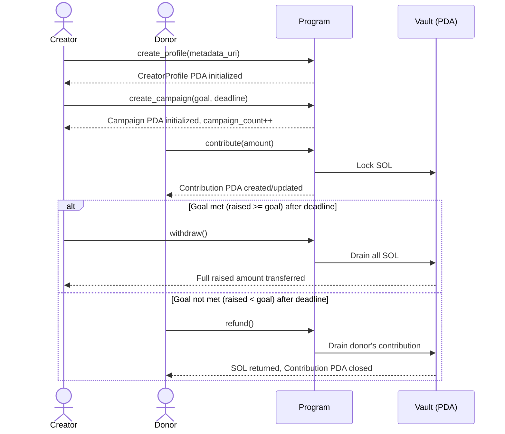
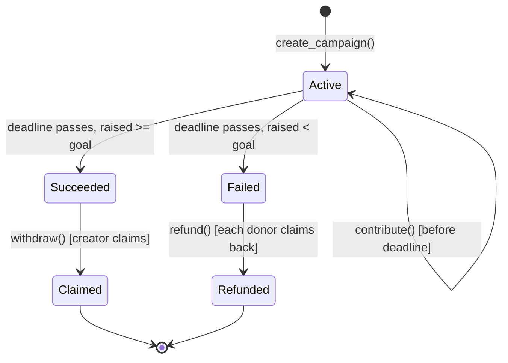
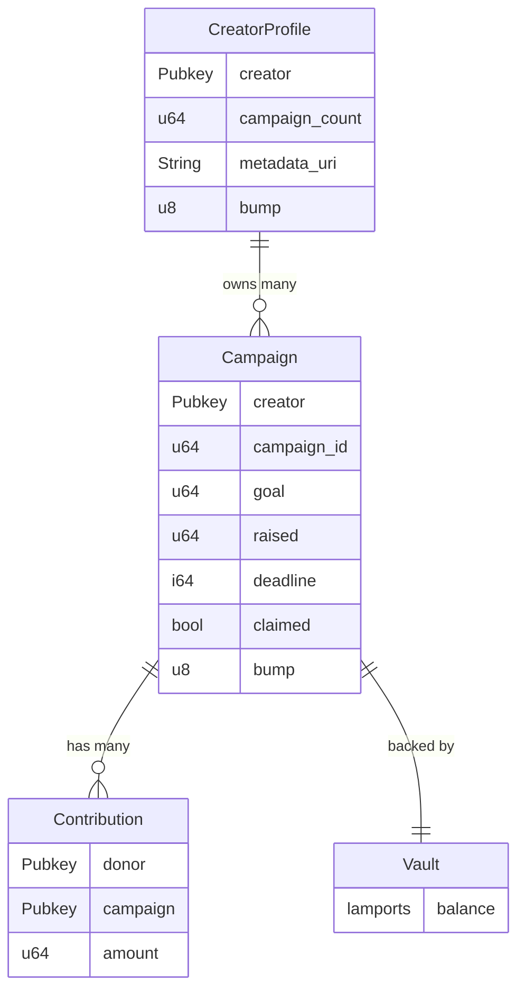

# Solana Crowdfunding

A crowdfunding smart contract on Solana built with the Anchor framework. Creators register a profile, launch campaigns with a funding goal and deadline, and receive funds only if the goal is met. Contributions are locked in a system-owned PDA vault — never held directly by the program. If the goal is not met, donors can reclaim their contributions after the deadline.

Overfunding is intentionally allowed — contributors can donate beyond the goal, and the creator receives the full raised amount.

## How It Works



## Campaign Lifecycle



## Account Structure



## Instructions

| Instruction       | Caller  | Conditions                             | Effect                                                      |
| ----------------- | ------- | -------------------------------------- | ----------------------------------------------------------- |
| `create_profile`  | Anyone  | Profile does not exist yet             | Initializes `CreatorProfile` PDA with metadata URI          |
| `update_profile`  | Creator | Profile exists, caller is creator      | Updates `metadata_uri` on existing profile                  |
| `create_campaign` | Creator | Profile exists, deadline in the future | Initializes `Campaign` PDA, increments `campaign_count`     |
| `contribute`      | Anyone  | Before deadline                        | Locks SOL in vault, updates `raised` and `Contribution` PDA |
| `withdraw`        | Creator | After deadline, `raised >= goal`       | Drains vault to creator, marks campaign `claimed`           |
| `refund`          | Donor   | After deadline, `raised < goal`        | Returns donor's SOL, closes `Contribution` PDA              |

## Contribution Rules

- Overfunding is **allowed** — a donor can contribute any amount regardless of the current `raised` vs `goal`
- A donor can contribute **multiple times**; amounts accumulate in their `Contribution` PDA
- The only restriction is the deadline — no contributions accepted after it passes
- Minimum contribution is **1 lamport** (zero-amount contributions are rejected)

## PDA Seeds

| Account          | Seeds                                                      |
| ---------------- | ---------------------------------------------------------- |
| `CreatorProfile` | `["profile", creator_pubkey]`                              |
| `Campaign`       | `["campaign", creator_pubkey, campaign_id (u64 le bytes)]` |
| `Vault`          | `["vault", campaign_pubkey]`                               |
| `Contribution`   | `["contribution", campaign_pubkey, donor_pubkey]`          |

> `campaign_id` equals the creator's `campaign_count` value at the time of campaign creation, encoded as 8-byte little-endian. Clients should read `profile.campaign_count` before calling `create_campaign` to derive the next campaign PDA.

## Error Reference

| Error                   | Cause                                     |
| ----------------------- | ----------------------------------------- |
| `InvalidDeadline`       | Deadline is not in the future             |
| `DeadlineNotReached`    | Withdraw/refund attempted before deadline |
| `DeadlinePassed`        | Contribution attempted after deadline     |
| `GoalNotReached`        | Withdraw attempted but `raised < goal`    |
| `GoalAlreadyReached`    | Refund attempted but `raised >= goal`     |
| `AlreadyClaimed`        | Withdraw attempted after already claimed  |
| `Unauthorized`          | Non-creator attempted to withdraw         |
| `NothingToRefund`       | Donor has zero contribution amount        |
| `UriTooLong`            | `metadata_uri` exceeds 200 characters     |
| `ZeroAmount`            | Contribution amount is zero               |
| `CampaignCountOverflow` | Creator has created `u64::MAX` campaigns  |

## Project Structure

This project is a monorepo managed by `pnpm` workspaces.

```txt
apps/
└── crowdfunding-anchor/
    ├── programs/crowdfunding/src/ # Program logic (Rust/Anchor)
    │   ├── lib.rs                 # Program entry point
    │   ├── error.rs               # Custom error codes
    │   ├── state/                 # Account structs
    │   └── instructions/          # Instruction handlers
    └── tests/                     # LiteSVM-powered test suite
        ├── crowdfunding.000.profile.test.ts
        ├── crowdfunding.001.campaign.test.ts
        ├── crowdfunding.002.contribute.test.ts
        ├── crowdfunding.003.withdraw.test.ts
        ├── crowdfunding.004.refund.test.ts
        └── utils.ts
packages/
└── crowdfunding-sdk/             # TypeScript SDK for the program
    └── src/
        ├── index.ts               # Main entry point
        ├── pda.ts                 # PDA derivation helpers
        ├── events.ts              # Event parsing utilities
        ├── types/                 # Generated types from IDL
        └── idl/                   # Program IDL
```

## Prerequisites

- [Rust](https://rustup.rs/) — `rustup install stable`
- [Solana CLI](https://docs.solana.com/cli/install-solana-cli-tools) — v1.18+
- [Anchor CLI](https://www.anchor-lang.com/docs/installation) — v0.32+
- [Node.js](https://nodejs.org/) v18+ + [pnpm](https://pnpm.io/)

## Setup

```bash
# Install dependencies for all workspaces
pnpm install

# Build all packages and the program
pnpm build
```

The program is located in `apps/crowdfunding-anchor`. After building, you can find the program ID:

```bash
cd apps/crowdfunding-anchor
anchor keys list
```

Update `declare_id!("...")` in `apps/crowdfunding-anchor/programs/crowdfunding/src/lib.rs` and `[programs.localnet]` in `apps/crowdfunding-anchor/Anchor.toml` with the output from `anchor keys list`, then rebuild:

```bash
pnpm build
```

## Running Tests

Tests are powered by [Anchor LiteSVM](https://github.com/LiteSVM/anchor-litesvm) with [LiteSVM](https://github.com/LiteSVM/litesvm) underneath, allowing for extremely fast execution without needing a local validator.

```bash
# Run all tests (program + SDK)
pnpm test

# Or run tests specifically in the anchor app
cd apps/crowdfunding-anchor
anchor test
```

The test suite is split into specialized files for better readability and maintainability:

- `profile`: Profile creation and metadata updates
- `campaign`: Campaign initialization logic
- `contribute`: Donation flow
- `withdraw`: Campaign creator withdrawal flows
- `refund`: Donor refund flow for failed campaign

## Deployment

```bash
cd apps/crowdfunding-anchor

# Switch to devnet
solana config set --url devnet

# Fund your wallet (if needed)
solana airdrop 2

# Deploy
anchor deploy --provider.cluster devnet

# Verify deployment
solana program show <PROGRAM_ID> --url devnet
```

## Deployment Info

|                |                                                                                                           |
| -------------- | --------------------------------------------------------------------------------------------------------- |
| **Network**    | Solana Devnet                                                                                             |
| **Program ID** | `3qUXqi2J3W9juVRqZNrwjpH9WPfzx8wHaPAboXVJVPpp`                                                            |
| **Solscan**    | [View on Solscan](https://solscan.io/account/3qUXqi2J3W9juVRqZNrwjpH9WPfzx8wHaPAboXVJVPpp?cluster=devnet) |
