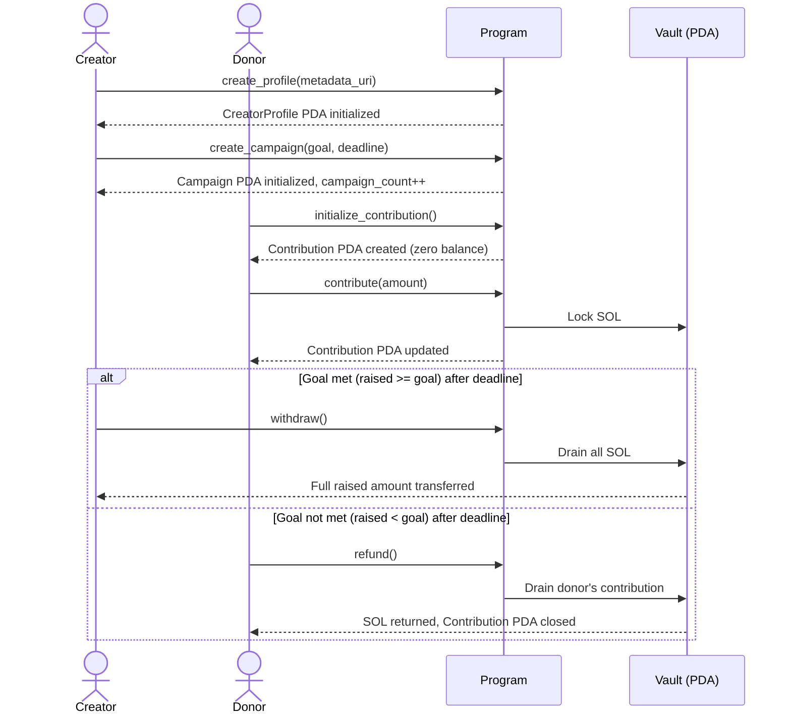
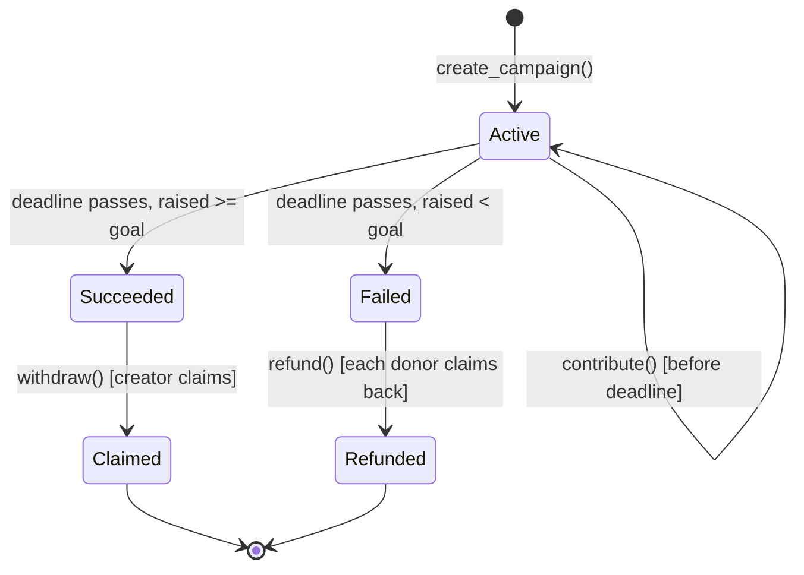
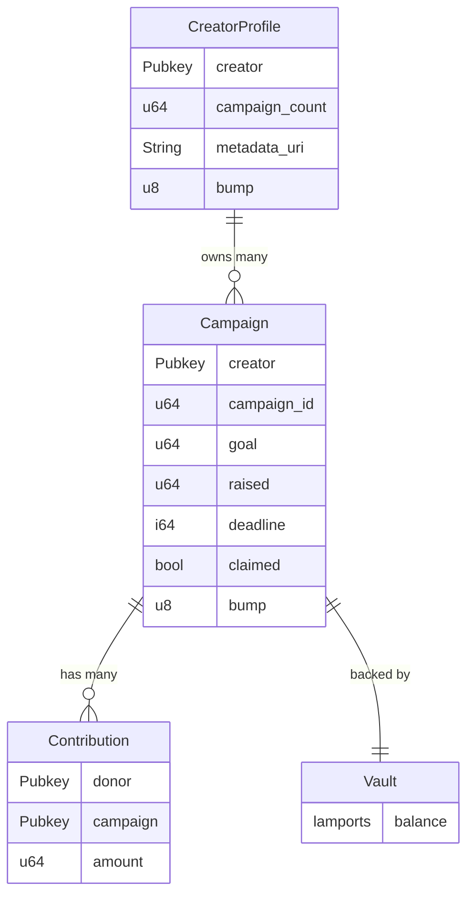

# Solana Crowdfunding

A crowdfunding smart contract on Solana built with Anchor. Creators register a profile, launch campaigns with a funding goal and deadline, and receive funds only if the goal is met. Contributions sit in a system-owned PDA vault — the program never holds them directly. If the goal isn't met, donors can reclaim their contributions after the deadline.

Overfunding is intentional — contributors can donate beyond the goal, and the creator receives the full raised amount.

## How it works



## Campaign lifecycle



## Account structure



## Instructions

| Instruction               | Caller  | Conditions                                | Effect                                                  |
| ------------------------- | ------- | ----------------------------------------- | ------------------------------------------------------- |
| `create_profile`          | Anyone  | Profile does not exist yet                | Initializes `CreatorProfile` PDA with metadata URI      |
| `update_profile`          | Creator | Profile exists, caller is creator         | Updates `metadata_uri` on existing profile              |
| `create_campaign`         | Creator | Profile exists, deadline in the future    | Initializes `Campaign` PDA, increments `campaign_count` |
| `initialize_contribution` | Donor   | Campaign exists                           | Creates `Contribution` PDA with zero balance            |
| `contribute`              | Donor   | Before deadline, contribution PDA exists  | Locks SOL in vault, updates `raised` and contribution   |
| `withdraw`                | Creator | After deadline, `raised >= goal`          | Drains vault to creator, marks campaign `claimed`       |
| `refund`                  | Donor   | After deadline, `raised < goal`           | Returns donor's SOL, closes `Contribution` PDA          |

## Contribution rules

- A donor must call `initialize_contribution` before their first `contribute` to a campaign. This creates the `Contribution` PDA that tracks their balance.
- Overfunding is allowed — a donor can contribute any amount regardless of current `raised` vs `goal`.
- A donor can contribute multiple times; amounts accumulate in their `Contribution` PDA.
- The only restriction is the deadline — no contributions accepted after it passes.
- Minimum contribution is 1 lamport. Zero-amount contributions are rejected.

## PDA seeds

| Account          | Seeds                                                      |
| ---------------- | ---------------------------------------------------------- |
| `CreatorProfile` | `["profile", creator_pubkey]`                              |
| `Campaign`       | `["campaign", creator_pubkey, campaign_id (u64 le bytes)]` |
| `Vault`          | `["vault", campaign_pubkey]`                               |
| `Contribution`   | `["contribution", campaign_pubkey, donor_pubkey]`          |

`campaign_id` equals the creator's `campaign_count` at the time of campaign creation, encoded as 8-byte little-endian. Read `profile.campaign_count` before calling `create_campaign` to derive the next campaign PDA.

## Events

The program emits Anchor events on every state change. Parse them from transaction logs using the SDK's `parseEvents` helper (see [SDK](#sdk)).

| Event                     | Fields                                                |
| ------------------------- | ----------------------------------------------------- |
| `ProfileCreated`          | `creator`, `metadata_uri`                             |
| `ProfileUpdated`          | `creator`, `metadata_uri`                             |
| `CampaignCreated`         | `creator`, `campaign`, `campaign_id`, `goal`, `deadline` |
| `ContributionInitialized` | `campaign`, `donor`                                   |
| `ContributionMade`        | `campaign`, `donor`, `amount`, `total_raised`         |
| `FundsWithdrawn`          | `campaign`, `creator`, `amount`                       |
| `RefundIssued`            | `campaign`, `donor`, `amount`                         |

## Error reference

| Error                   | Cause                                     |
| ----------------------- | ----------------------------------------- |
| `InvalidDeadline`       | Deadline is not in the future             |
| `DeadlineNotReached`    | Withdraw/refund attempted before deadline |
| `DeadlinePassed`        | Contribution attempted after deadline     |
| `GoalNotReached`        | Withdraw attempted but `raised < goal`    |
| `GoalAlreadyReached`    | Refund attempted but `raised >= goal`     |
| `AlreadyClaimed`        | Withdraw attempted after already claimed  |
| `Unauthorized`          | Non-creator attempted to withdraw         |
| `NothingToRefund`       | Donor has zero contribution amount        |
| `UriTooLong`            | `metadata_uri` exceeds 200 characters     |
| `ZeroAmount`            | Contribution amount is zero               |
| `CampaignCountOverflow` | Creator has created `u64::MAX` campaigns  |

## Project structure

A monorepo managed by pnpm workspaces.

```txt
apps/
├── crowdfunding-anchor/
│   ├── programs/crowdfunding/src/  # Program logic (Rust/Anchor)
│   │   ├── lib.rs                  # Program entry point
│   │   ├── error.rs                # Custom error codes
│   │   ├── event.rs                # Anchor event definitions
│   │   ├── state/                  # Account structs
│   │   └── instructions/           # Instruction handlers
│   └── tests/                      # LiteSVM-powered test suite
│       ├── crowdfunding.000.profile.test.ts
│       ├── crowdfunding.001.campaign.test.ts
│       ├── crowdfunding.002.contribute.test.ts
│       ├── crowdfunding.003.withdraw.test.ts
│       ├── crowdfunding.004.refund.test.ts
│       └── utils.ts
└── web/                            # React frontend (Vite + TanStack Router)
    └── app/
        ├── routes/                 # File-based routes
        │   ├── __root.tsx
        │   ├── index.tsx           # Campaign listing
        │   ├── create.tsx          # Create campaign
        │   ├── campaign.$address.tsx  # Campaign detail
        │   ├── profile.tsx         # Profile layout
        │   ├── program.tsx         # Program info
        │   └── profile/
        │       ├── index.tsx       # View/edit profile
        │       └── create.tsx      # Create profile
        ├── components/
        │   ├── campaign/           # CampaignCard, CampaignList, CampaignDetail, ContributionForm, CreateCampaignForm
        │   ├── profile/            # ProfileCard, CreateProfileForm
        │   ├── program/            # ProgramDetail
        │   ├── solana/             # SolanaProvider, WalletButton
        │   └── ui/                 # Button, Card, Input, Label, Progress, Skeleton
        ├── hooks/                  # React Query hooks
        │   ├── use-campaign.ts
        │   ├── use-campaigns.ts
        │   ├── use-contribution.ts
        │   ├── use-profile.ts
        │   ├── use-program.ts
        │   ├── use-program-info.ts
        │   └── use-transactions.ts
        └── utils/                  # cn (classnames), format helpers
packages/
└── crowdfunding-sdk/               # TypeScript SDK
    └── src/
        ├── index.ts                # Re-exports everything
        ├── pda.ts                  # PDA derivation helpers
        ├── events.ts               # Event parsing utilities
        ├── types/                  # Generated types from IDL
        └── idl/                    # Program IDL (JSON)
```

## SDK

The `@crowdfunding/sdk` package (`packages/crowdfunding-sdk`) is the TypeScript client for the program. The web app imports it as a workspace dependency.

**Exports:**

- **PDA helpers** — `getProfilePda`, `getCampaignPda`, `getVaultPda`, `getContributionPda`. Each takes the required public keys and the program ID, returns `[PublicKey, bump]`.
- **Event parsing** — `parseEvents(provider, program, txSignature)` fetches a confirmed transaction and returns decoded Anchor events. `findEvent(events, name)` looks up an event by name or throws.
- **Types** — Generated TypeScript types matching the on-chain account structs and instruction arguments.
- **IDL** — The program IDL as a JSON object (`CrowdfundingIdl`), plus the `PROGRAM_ID` constant derived from it.

## Prerequisites

- [Rust](https://rustup.rs/) — `rustup install stable`
- [Solana CLI](https://docs.solana.com/cli/install-solana-cli-tools) — v1.18+
- [Anchor CLI](https://www.anchor-lang.com/docs/installation) — v0.32+
- [Node.js](https://nodejs.org/) v18+ + [pnpm](https://pnpm.io/)

## Setup

```bash
# Install dependencies for all workspaces
pnpm install

# Build everything (packages + program)
pnpm build
```

Targeted scripts in the root `package.json`:

| Script               | What it does                                                        |
| -------------------- | ------------------------------------------------------------------- |
| `pnpm program:build` | Builds the Anchor program, syncs the IDL into the SDK, builds SDK  |
| `pnpm sdk:sync`      | Copies the latest IDL from the program build into the SDK package   |
| `pnpm sdk:build`     | Builds only the SDK package                                         |

The program lives in `apps/crowdfunding-anchor`. After building, get your program ID:

```bash
cd apps/crowdfunding-anchor
anchor keys list
```

Update `declare_id!("...")` in `programs/crowdfunding/src/lib.rs` and `[programs.localnet]` in `Anchor.toml` with the output, then rebuild.

## Running tests

Tests run on [Anchor LiteSVM](https://github.com/LiteSVM/anchor-litesvm) with [LiteSVM](https://github.com/LiteSVM/litesvm) underneath — no local validator needed.

```bash
# Run all tests (program + SDK)
pnpm test

# Or just the program tests
cd apps/crowdfunding-anchor
anchor test
```

Test files:

- `profile` — Profile creation and metadata updates
- `campaign` — Campaign initialization
- `contribute` — Donation flow
- `withdraw` — Creator withdrawal
- `refund` — Donor refund for failed campaigns

## Program deployment

```bash
cd apps/crowdfunding-anchor

# Switch to devnet
solana config set --url devnet

# Fund your wallet (if needed)
# if doesn't work then can use https://faucet.solana.com
solana airdrop 2

# Deploy
anchor deploy --provider.cluster devnet

# Verify
solana program show <PROGRAM_ID> --url devnet
```

## Web frontend

The React frontend (`apps/web`) is deployed to Cloudflare Pages via GitHub Actions. A push to `main` that touches `apps/web/` or `packages/crowdfunding-sdk/` triggers an automatic build and deploy.

Preview deploys are created for pull requests at `<branch>.crowdfunding-web.pages.dev`.

### One-time setup

1. Create a Cloudflare API token: Dashboard > API Tokens > Create Token > Custom > `Account > Cloudflare Pages > Edit`
2. Get your Account ID from the Cloudflare dashboard sidebar
3. Create the Pages project: `pnpm dlx wrangler pages project create crowdfunding-web --production-branch=main`
4. Add two GitHub repo secrets (`Settings > Secrets and variables > Actions`):
   - `CLOUDFLARE_API_TOKEN`
   - `CLOUDFLARE_ACCOUNT_ID`

### Local manual deploy

```bash
# Authenticate once
pnpm dlx wrangler login

# Build and deploy
pnpm --filter @crowdfunding/web build
pnpm --filter @crowdfunding/web deploy
```

SPA routing works out of the box — Cloudflare Pages auto-detects a client-side router when there is no `404.html` and serves `index.html` for all unmatched paths.

## Deployment info

|                |                                                                                                           |
| -------------- | --------------------------------------------------------------------------------------------------------- |
| **Network**    | Solana Devnet                                                                                             |
| **Program ID** | `CYHkx1NUFKahYj4esTR6iuk5MnTZgCKsxufbD2cdK94k`                                                            |
| **Solscan**    | [View on Solscan](https://solscan.io/account/CYHkx1NUFKahYj4esTR6iuk5MnTZgCKsxufbD2cdK94k?cluster=devnet) |


## Browser compatibility

Solana's web3.js and wallet adapter libraries use Node.js globals (`Buffer`, `process`, `global`) that do not exist in browsers. This project polyfills them in `apps/web/app/main.tsx` before anything else loads:

```ts
import { Buffer } from "buffer";
import process from "process";
globalThis.Buffer = Buffer;
globalThis.process = process;
```

The Vite config also maps `global` to `globalThis`:

```ts
// apps/web/vite.config.ts
define: {
  global: "globalThis",
}
```

If a new dependency triggers a `crypto is not defined` or `stream is not defined` error at runtime, add the corresponding alias to `vite.config.ts` and install the browser polyfill:

| Missing module | Polyfill package       | Vite alias                                      |
| -------------- | ---------------------- | ----------------------------------------------- |
| `crypto`       | `crypto-browserify`    | `resolve: { alias: { crypto: "crypto-browserify" } }` |
| `stream`       | `stream-browserify`    | `resolve: { alias: { stream: "stream-browserify" } }` |

These are rarely needed in practice — most Solana wallet adapters have browser-native fallbacks. Only add them if you hit actual runtime errors.